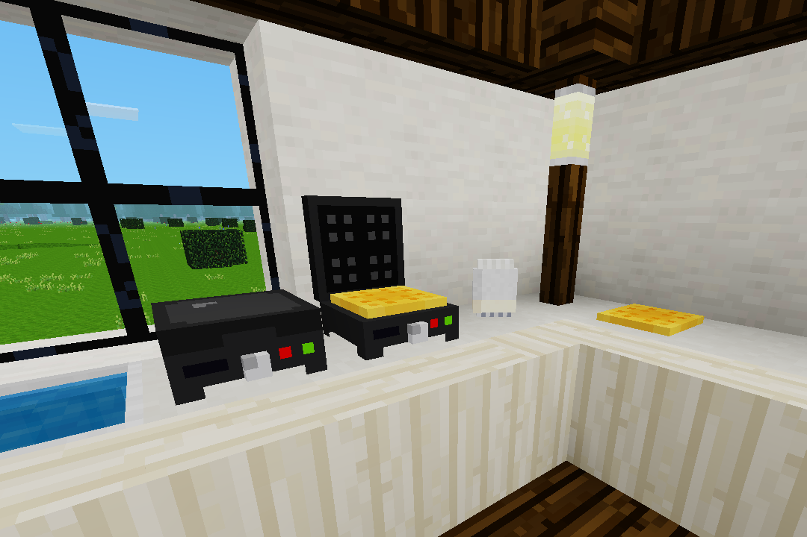

# Waffles
_"And in the mornin', I'm makin' waffles!" - Donkey, Shrek 2001_



### _Waffles for Dummies:_
1. Obtain a waffle maker.
2. Place the waffle maker.
3. Obtain batter.
4. Open the waffle maker.
5. Place some batter in the waffle maker.
6. Close the waffle maker.
7. Wait for the waffle maker to open.
8. Take the cooked waffle.
9. Consume the cooked waffle.
10. Repeat from step 5.

### Recipes
_All listed items are configurable. See [Configuration](#configuration)_.

`waffles:waffle_maker`:
```
C = casing (default:tin_ingot)
W = wiring (default:steel_ingot)
H = heating (default:copper_ingot)

+-+-+-+
|C|C|C|
+-+-+-+
|W| |W|
+-+-+-+
|C|H|C|
+-+-+-+
```

`waffles:waffle_batter_3`:
```
1 = ingredient 1 (farming:flour)
2 = ingredient 2 (farming:flour)
W = water (bucket:bucket_water)

(Shapeless)
+-+-+-+
|1|2|W|
+-+-+-+
```

### Configuration
Configurable craftitems:

* `waffles.craftitem_maker_casing` (Waffle maker casing craftitem)
* `waffles.craftitem_maker_wiring` (Waffle maker wiring craftitem)
* `waffles.craftitem_maker_heating` (Waffle maker heating craftitem)
* `waffles.craftitem_batter_ingredient_1` (Waffle batter ingredient 1 craftitem)
* `waffles.craftitem_batter_ingredient_2` (Waffle batter ingredient 2 craftitem)
* `waffles.craftitem_batter_ingredient_water` (Waffle batter water craftitem)

If you use your own water ingredient, you may prevent batter returning a bucket using `waffles.return_batter_bucket`.
